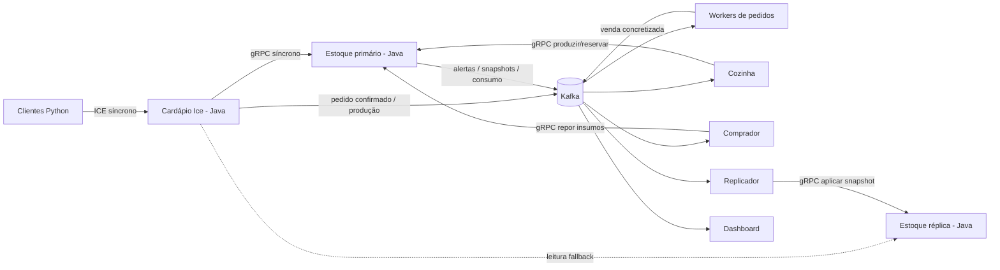

# Arquitetura do sistema da marmitaria

## Responsabilidades

### Cardápio Ice

Recebe pedidos de clientes remotos, calcula o valor, solicita uma reserva atômica ao estoque e apresenta propostas de produção ou atendimento parcial. Ele não altera arquivos do inventário diretamente.

### Serviço gRPC de estoque

É a autoridade do inventário. Mantém marmitas prontas, insumos, versão do estado, estado da loja e IDs já processados em um snapshot único. As operações de negócio são atômicas no nível da aplicação.

### Kafka

Combina dois usos:

- **fila de trabalho:** `pedidos.confirmados` e `pedidos.producao`; consumidores do mesmo grupo dividem as partições;
- **publish-subscribe:** alertas, vendas, consumo e snapshots; grupos diferentes recebem cópias independentes.

### Cozinha

Atende pedidos que dependem de produção e também reage a alertas de marmita baixa. A produção consome insumos; a venda de marmitas prontas não desconta insumos novamente.

### Comprador

Reage a alertas de insumos baixos e chama `ReporInsumos` com um ID derivado do alerta, tornando a compra idempotente.

### Workers de pedidos

Processam pedidos confirmados. Várias instâncias no mesmo consumer group implementam paralelismo e balanceamento por partições.

### Réplica

Recebe snapshots de forma assíncrona e serve leituras quando o primário não responde. Escritas na réplica são rejeitadas.

## Tópicos

| Tópico | Semântica | Chave sugerida |
|---|---|---|
| `pedidos.confirmados` | fila para workers | `pedido_id` |
| `pedidos.producao` | fila para cozinha | `pedido_id` |
| `pedidos.producao.resultado` | resultado assíncrono | `pedido_id` |
| `vendas.concretizadas` | evento de venda | `pedido_id` |
| `alertas.estoque` | alerta pub-sub | item |
| `itens.consumidos` | consumo ocorrido na produção | `operacao_id` |
| `estoque.snapshots` | replicação de estado | `inventario` |

## Regra de estoque

- P: 1 porção de cada base, 1 porção da proteína escolhida e 1 embalagem P.
- M: 2 porções de cada base, 2 da proteína e 1 embalagem M.
- G: 3 porções de cada base, 3 da proteína e 1 embalagem G.

A proteína foi separada em bovina, suína e frango. O estoque de marmitas prontas também diferencia tamanho e proteína, por exemplo `M_FRANGO`.
